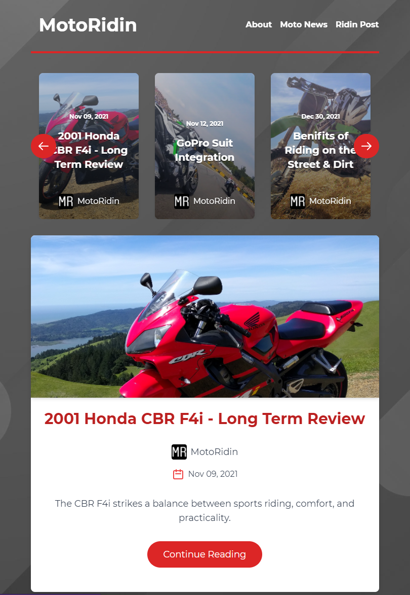

# [MotoRidin Blog](https://www.motorid.in/)

Responsive blog application created and customized for myself to practice hosting and building a fully featured site. Components include featured / recent posts, categories, full markdown articles, author information, comments. Using GraphQL and GraphCMS to create a dedicated CMS, clients can manage the blog. 

The blog itself is a continuing project building on my passion for riding two wheels and web development.

## Structure

A React based app that utilizes GraphQL / GraphCMS for content creation. Tailwindcss is used for component styling. 

## Planned Upgrades

**Rich Text Rendering:**
Richtext isn't displaying properly. Hyperlinks and video embeds using Iframe are not displaying properly. Or being passed properly for redering.

**Increase Performance:** Needs improvement on the homepage to get a higher lighthouse score, also SEO needs to implemented.
